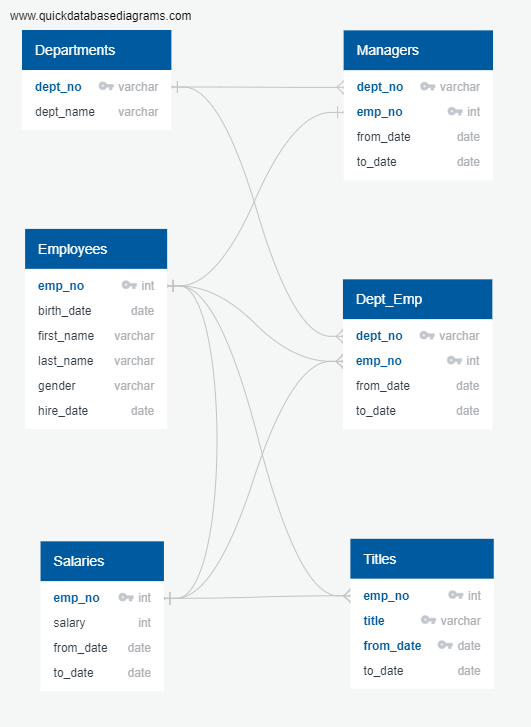
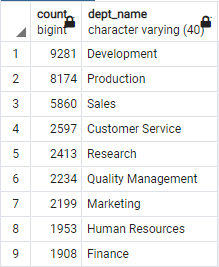
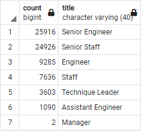
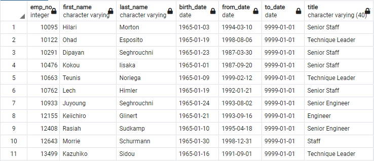

# Pewlett_Hackard_Analysis
Transforming employees' data from CSV files into a structured database using SQL.

## Project Overview
Pewlett Hackard is a large company boasting several thousand employees, and it's been around for a long time. 
As baby boomers begin to retire at a rapid rate, Pewlett Hackard is looking toward the future in two ways:  
1. Offering a retirement package for those who meet certain criteria.
2. Starting to think about which positions will need to be filled in the near future. 

The number of upcoming retirements will leave thousands of job openings, which would require the company to have a robust employee database and a well-founded transition plan to fill these many vacancies. 

The HR department has requested an analysis of the company's current employees' information to identify the retirement-eligible employees,  
the number of positions that Pewlett Hackard will need to fill soon, in addition to the retiring titles and mentorship opportunities.  

This analysis will help future-proof Pewlett Hackard by upgrading the employees' information from CSV files to a relational database using SQL.  

## Objectives
The tasks in this project require transforming the employees' information from CSV files to a database first, then finding answers to the following questions:
1. Who will be retiring in the next few years? and of those employees, who is eligible for a retirement package?
2. How many positions will Pewlett Hackard need to fill? 

### Challenge Overview
1. How many employees will be retiring, per title?
2. Who are the eligible employees for a mentorship program?

## Resources
- Data sources: departments.csv, dept_emp.csv, dept_manager.csv, employees.csv, salaries.csv, titles.csv.
- Software: PostgreSQL (version 11), pgAdmin 4 (version 6.7).
- Libraries & Packages: Quick Database Diagrams (Quick DBD) online tool.

## Pewlett Hackard Focused Analysis Results
1. The first outcome of this project entailed upgrading the employees' information system in two steps:
    - First, by creating an Entity Relationship Diagram using the Quick DBD online tool, which represents the connections between the data 
      files based on primary or foreign keys, or a combination of both, and how they depend on each other to give a complete profile of 
      every employee at the Pewlett Hackard company. 
      
    - Second, building a relational DataBase based on the depicted schema in the ERD by importing all the data from the CSV files 
      mentioned in the Resources. Each CSV file is imported into one table in the DataBase.
      - A detailed look at the DataBase schema is available here: [PH_EmployeeDB_schema](https://github.com/Magzzie/Pewlett_Hackard_Analysis/blob/main/schema.sql)
      
2. The retirement-eligible employees' criteria were defined by the HR department to include all employees born between Jan 1, 1952,  
    and Dec 31, 1955, and hired between Jan 1, 1985, and Dec 31, 1988. 
3. The number of eligible employees, according to the prementioned criteria, is (41,380) employees. 
    - You can find the complete list of retirement-eligible employees based on birth and hiring dates in the following CSV file: 
      [retirement_info.csv](https://github.com/Magzzie/Pewlett_Hackard_Analysis/blob/main/Data/retirement_info.csv)
4. The number of employees to retire in the next few years who were born and hired as stated in the eligibility criteria, but more accurately, are currently employed in the company, is (33,118) employees.
    - You can find the list of currently employed and retirement-eligible employees in the following CSV file: 
      [current_emp.csv](https://github.com/Magzzie/Pewlett_Hackard_Analysis/blob/main/Data/current_emp.csv)
5. We have created a list of possible vacancies for each department in the company to guide department managers in their transitioning efforts. 
    - It is worth noting that the sum of all departments count exceeds the true number of future retirees probably due to duplicate entries 
      of some employees who are involved in more than one department. 
   

### Challange Deliverables
1. When we looked at the titles given to all the retirement-eligible employees who were born between 1952 and 1955, we have found  
   a list of (133,776) titles assigned to them over their employment life. 
      - You can find their records including names, titles, and titles' dates in the following CSV file:  [retirement_titles.csv](https://github.com/Magzzie/Pewlett_Hackard_Analysis/blob/main/Data/retirement_titles.csv)
2. However, looking at the most recent title for each employee and excluding the ones who already left the job would give a better reflection of the retiring titles in the company.  This narrowed list includes (72,458) titles, which exceeds the number of retiring employees probably due to duplicate titles per certain employees.  
      - You can find these records in the following CSV file:  [unique_titles.csv](https://github.com/Magzzie/Pewlett_Hackard_Analysis/blob/main/Data/unique_titles.csv)
3. Finally, we created a tailored table to show the number of future job openings for each title, and it seems that a ***Senior Engineer***  
    position would be the most in-demand for this company.  
    
4. Instead of having a large part of the workforce retiring, it would be wise to introduce a mentoring program, for which experienced and successful employees can step back into a part-time role instead of retiring completely.   Their new role in the company would be as a mentor to the new hires.
   - The potential mentors are defined by the company's management team to be current employees who were born between Jan 1, 1965, and Dec 31, 1965. 
   - The number of potential mentors is (1,549) employees. 
   - You can find their records in the following CSV file:  [mentorship_eligibility.csv](https://github.com/Magzzie/Pewlett_Hackard_Analysis/blob/main/Data/mentorship_eligibility.csv) 
   

## Summary
1. There will be an estimate of (33,118) roles to be filled in Pewlett Hackard company over the next few years. 
2. There are only (1,549) qualified, retirement-ready employees in the departments to mentor the next generation of Pewlett Hackard employees. This means roughly 21 trainees per mentor which is considered inadequate for quality training.  

